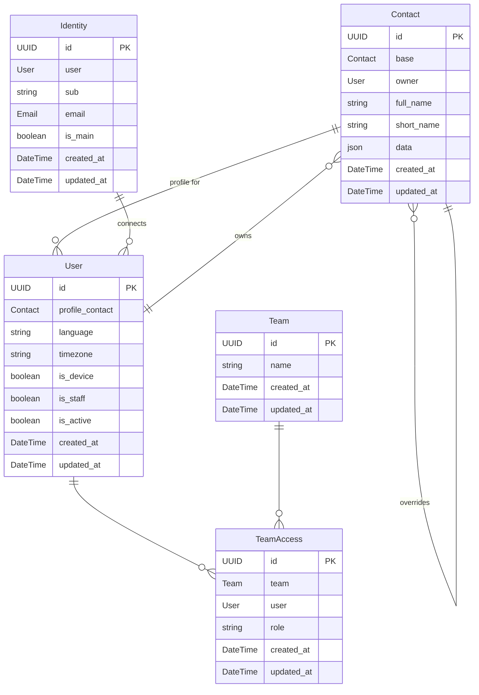

# What is People?

Space Odyssey is a dynamic organization. They use the People application to enhance teamwork and
streamline communication among  their co-workers. Let's explore how this application helps them
interact efficiently.

Let's see how we could interact with Django's shell to recreate David's environment in the app.

## Base contacts from the organization records

David Bowman is an exemplary employee at Space Odyssey Corporation. His email is
`david.bowman@spaceodyssey.com` and he is registered in the organization's records via a base
contact as follows:

```python
david_base_contact = Contact.objects.create(
    full_name="David Bowman",
    short_name="David",
    data={
        "emails": [
            {"type": "Work", "value": "david.bowman@spaceodyssey.com"},
        ],
        "phones": [
            {"type": "Work", "value": "(123) 456-7890"},
        ],
        "addresses": [
            {
                "type": "Work",
                "street": "123 Main St",
                "city": "Cityville",
                "state": "CA",
                "zip": "12345",
                "country": "USA",
            }
        ],
        "links": [
            {"type": "Website", "value": "http://www.spaceodyssey.com"},
            {"type": "Twitter", "value": "https://www.twitter.com/dbowman"},
        ],
        "organizations": [
            {
                "name": "Space Odyssey Corporation",
                "department": "IT",
                "jobTitle": "AI Engineer",
            },
        ],
    }
)
```

When David logs-in to the People application for the first time using the corporation's OIDC
Single Sign-On service. A user is created for him on the fly by the system, together with an
identity record representing the OIDC session:

```python
david_user = User.objects.create(
    language="en-us",
    timezone="America/Los_Angeles",
)
david_identity = Identity.objects.create(
  "user": david_user,
  "sub": "2a1b3c4d-5e6f-7a8b-9c0d-1e2f3a4b5c6d",
  "email" : "david.bowman@spaceodyssey.com",
  "is_main": True,
)
```

## Profile contact

The system identifies Dave through the email associated with his OIDC session and prompts him to
confirm the details of the base contact stored in the database.

When David confirms, giving an alternative short name that he prefers, a contact override is
created on top of the organization's base contact. This new contact is marked as David's profile
on the user:

```python
david_contact = Contact.objects.create(
    base=david_base_contact,
    owner=david_user,
    full_name="David Bowman",
    short_name="Dave",
    data={}
)
david_user.profile_contact = david_contact
david_user.save()
```

If Dave had not had any existing contact in the organization's records, the profile contact would
have been created independently, without any connection to a base contact:

```python
david_contact = Contact.objects.create(
    base=None,
    owner=david_user,
    full_name="David Bowman",
    short_name="Dave",
    data={}
)
```

Now, Dave feels like sharing his mobile phone number with his colleagues. He can do this
by editing his contact in the application:

```python
contact.data["phones"] = [
    {"type": "Mobile", "value": "(123) 456-7890"},
]
contact.save()
```

## Contact override

During a Space conference he attended, Dave met Dr Ryan Stone, a medical engineer who gave him
her professional email address. Ryan is already present in the system but her email is missing.
Dave can add it to his private version of the contact:

```python
ryan_base_contact = Contact.objects.create(
    full_name="Ryan Stone",
    data={}
)
ryan_contact = Contact.objects.create(
    base=ryan_base_contact,
    owner=david_user,
    full_name="Ryan Stone",
    short_name="Dr Ryan",
    data={
        "emails": [
            {"type": "Work", "value": "ryan.stone@hubblestation.com"},
        ],
    }
)
```

## Team Collaboration

Dave wants to form a team with Ryan and other colleagues to work together better on using the organization's digital tools for their projects.

Dave would like to create a team with Ryan and some other colleagues, to enhance collaboration
throughout their projects:

```python
projectx = Team.objects.create(name="Project X")
```

A team can for example be used to create an email alias or to define role based access rights
(RBAC) in a specific application or all applications of the organization's digital Suite.

Having created he team, Dave is automatically assigned the "owner" role. He invites Ryan,
granting an "administrator" role to her so she can invite her own colleagues. Both of them can
then proceed to invite other colleagues as simple members. If Ryan wants, she can upgrade a
colleague to "administrator" but only David can upgrade someone to the "owner" status:

```python
TeamAccess.objects.create(user=david_user, team=projectx, role="owner")
TeamAccess.objects.create(user=ryan_user, team=projectx, role="administrator")
TeamAccess.objects.create(user=julie_user, team=projectx, role="member")
```

| Role                              | Member | Administrator | Owner |
|-----------------------------------|--------|---------------|-------|
| Can view team                     | ✔      | ✔             | ✔     |
| Can set roles except for owners   |        | ✔             | ✔     |
| Can set roles for owners          |        |               | ✔     |
| Can delete team                   |        |               | ✔     |

Importantly, the system ensures that there is always at least one owner left to maintain control
of the team.

# Models overview

The following graph represents the application's models and their relationships:


