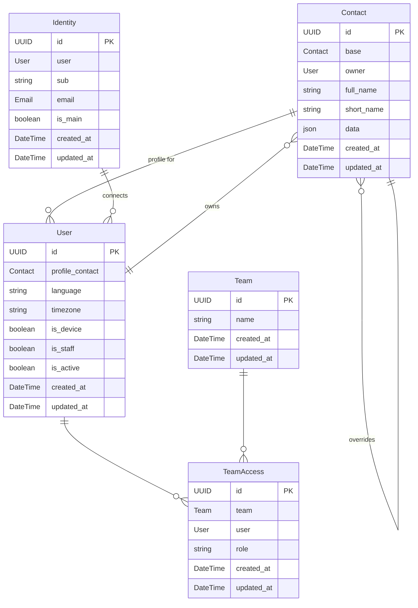

# What is People?

Space Odyssey is a dynamic organization. They use the People application to enhance teamwork and
streamline communication among  their co-workers. Let's explore how this application helps them
interact efficiently.

Let's see how we could interact with Django's shell to recreate David's environment in the app.

## Profile contact

The system identifies Dave through the `sub` associated with his OIDC session.
The OIDC should also provide his email address.

Note: as some Identity Providers do not provide a constant `sub`, the system should be able to
fallback to the email address to find it the user is already in the database.

When Dave logs in for the first time, the system checks if he is already in the database. If not
a new user is created for him.

Users needs to be linked to an Organization (see [organizations.md](./organizations.md)).

```python
space_odyssey, _created = Organization.objects.get_or_create(...)

david_user = User.objects.create(
    organization=space_odyssey,
    language="en-us",
    timezone="America/Los_Angeles",
    name="David Bowman",
    sub="1234567890",
    email="david.bowman@spaceodyssey.com",
)
```

The system then creates a profile contact for Dave, based on the information provided by the OIDC:

```python
david_profile_contact = Contact.objects.create(
    owner=david_user,
    user=david_user,  # this means it's the user's profile contact
    full_name="David Bowman",
    data={
        "emails": [
            {"type": "Work", "value": "david.bowman@spaceodyssey.com"},
        ],
    },
)
```

**Future feature:**
Dave will be prompted to confirm the details of the base contact stored in the database
and fill the details for a better profile.

His profile contact will be updated with the new information.

```python
Contact.objects.filter(user=david_user, owner=david_user).update(
    short_name="Dave",
    data={
        "emails": [
            {"type": "Work", "value": "david.bowman@spaceodyssey.com"},
        ],
        "phones": [
            {"type": "Work", "value": "(123) 456-7890"},
        ],
        "addresses": [
            {
                "type": "Work",
                "street": "123 Main St",
                "city": "Cityville",
                "state": "CA",
                "zip": "12345",
                "country": "USA",
            }
        ],
        "links": [
            {"type": "Website", "value": "http://www.spaceodyssey.com"},
            {"type": "Twitter", "value": "https://www.twitter.com/dbowman"},
        ],
        "organizations": [
            {
                "name": "Space Odyssey Corporation",
                "department": "IT",
                "jobTitle": "AI Engineer",
            },
        ],
    }
)
```

David's profile contact is available to all users of his company/organization.


## Contact override

During a Space conference he attended, Dave met Dr Ryan Stone, a medical engineer who gave him
her personal email address (because she will quit the company she works for). Ryan is already 
present in the system.

Dave can add it to his private version of the contact:

```python
ryan_user = User.objects.create(
    organization=space_odyssey,
    language="en-us",
    timezone="America/Los_Angeles",
    name="Ryan Stone",
    sub="0987654321",
    email="ryan.stone@spaceodyssey.com",
)

ryan_profile_contact = Contact.objects.create(
    user=ryan_user,
    owner=ryan_user,
    full_name="Ryan Stone",
    short_name="Dr Ryan",
    data={
        "emails": [
            {"type": "Work", "value": "ryan.stone@hubblestation.com"},
        ],
    },
)

david_ryan_contact = Contact.objects.create(
    override=ryan_profile_contact,
    owner=david_user,
    full_name="Ryan Stone",
    short_name="Dr Ryan",
    data={
        "emails": [
            {"type": "Home", "value": "ryan@stone.com"},
        ],
    },
)
```

## Personal contacts

Dave met a lot of people during the last Opensource Experience event. He can add them to his personal contacts:

```python
julie_personal_contact = Contact.objects.create(
    owner=david_user,
    full_name="Julie Powell",
    short_name="Julie",
    data={
        "emails": [
            {"type": "Work", "value": "julie.powell@example.com"},
        ],
        "phones": [
            {"type": "Work", "value": "(123) 456-7890"},
        ],
    },
)
```

These contacts are only available to Dave.


## Contacts from shared directories

This is a future feature that will allow Dave to access contacts from shared directories.
Shared directories will provide contacts for all users from several organizations.


## Team Collaboration

Dave wants to form a team with Ryan and other colleagues to work together better on using the organization's digital tools for their projects.

Dave would like to create a team with Ryan and some other colleagues, to enhance collaboration
throughout their projects:

```python
projectx = Team.objects.create(name="Project X")
```

A team can for example be used to create an email alias or to define role based access rights
(RBAC) in a specific application or all applications of the organization's digital Suite.

Having created he team, Dave is automatically assigned the "owner" role. He invites Ryan,
granting an "administrator" role to her so she can invite her own colleagues. Both of them can
then proceed to invite other colleagues as simple members. If Ryan wants, she can upgrade a
colleague to "administrator" but only David can upgrade someone to the "owner" status:

```python
TeamAccess.objects.create(user=david_user, team=projectx, role="owner")
TeamAccess.objects.create(user=ryan_user, team=projectx, role="administrator")
TeamAccess.objects.create(user=julie_user, team=projectx, role="member")
```

| Role                              | Member | Administrator | Owner |
|-----------------------------------|--------|---------------|-------|
| Can view team                     | ✔      | ✔             | ✔     |
| Can set roles except for owners   |        | ✔             | ✔     |
| Can set roles for owners          |        |               | ✔     |
| Can delete team                   |        |               | ✔     |

Importantly, the system ensures that there is always at least one owner left to maintain control
of the team.

# Models overview

The following graph represents the application's models and their relationships:


